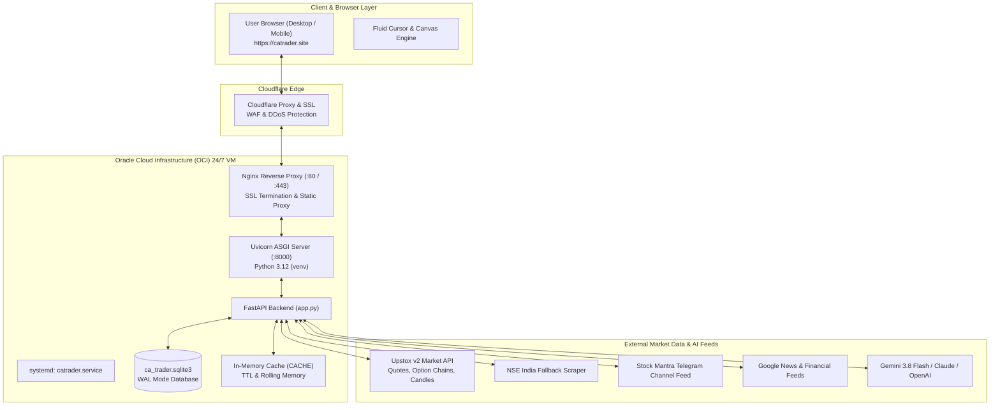

# CA Trader — Comprehensive Architecture, Data Flow & System Knowledge Base
> **Document Purpose:** Master reference guide for developers and Antigravity AI agents working on the CA Trader ecosystem. This document contains full technical specifications, data pipeline architectures, DOM structures, recent overhaul histories, and operational runbooks.
> **Last Updated:** 2026-09-28 (IST)
> **Active Production Branch:** `CA-Trader-Bifurcated`
> **Live Production Server:** [https://catrader.site](https://catrader.site) (Oracle Cloud 24/7 ARM64 VM)

---

## 1. Executive Summary & System Overview

**CA Trader** is a real-time institutional quantitative trading terminal and AI-driven decision engine designed specifically for the Indian equities and derivatives markets (NSE/BSE/MCX).

### Core Capabilities
1. **Dual Recommendation Engine**: Automatically generates real-time intraday, scalp, and swing call/put trading setups for major indices (`NIFTY`, `BANKNIFTY`, `FINNIFTY`, `MIDCPNIFTY`, `SENSEX`) and heavyweight equities (`RELIANCE`, `HDFCBANK`, `ICICIBANK`, `TCS`, `INFY`, `CRUDEOIL`).
2. **Institutional Confluence Matrix (40+ Quantitative Criteria)**: Dynamically weights Option Greeks, Order Flow, Depth, VWAP, Supertrend, RSI, MACD, Global Benchmarks, and Corporate Catalysts into an algorithmic consensus score (0–100%).
3. **Stock Mantra Telegram Advisory Integration**: Live streaming advisory consensus from top institutional channels factoring with 50% relative weightage during market hours (09:15–15:30 IST) and gracefully neutralizing to 0% when markets are closed.
4. **Live Interactive Terminal**: Single-page application providing Lightweight Charts, real-time Option Chain matrices, News Intelligence with session-based sentiment parsing, Market Movers, Paper Trading portfolio execution, and Cyberpunk AI synthesis.
5. **Interactive UI Customization ("Edit UI Mode")**: In-place visual editing with undo/redo capabilities, element repositioning/deletion, and server-side layout override persistence.

---

## 2. Infrastructure & Hosting Topology



### Production Host Details
- **IP Address:** `80.225.236.5`
- **SSH User:** `ubuntu`
- **SSH Key:** `oracle_key.key`
- **App Path on Server:** `/home/ubuntu/CA-Trader`
- **Virtualenv Path:** `/home/ubuntu/venv`
- **Systemd Service:** `catrader.service` (`sudo systemctl status catrader`)
- **Port Binding:** Localhost `127.0.0.1:8000` (Nginx proxies `catrader.site` $\rightarrow$ `127.0.0.1:8000`)
- **Database:** `/home/ubuntu/CA-Trader/ca_trader.sqlite3`

---

## 3. Repository & Workspace Structure

The local workspace has two mirrored copies of critical application files. **Both must remain synchronized**:
- **Primary Git Repo:** `tools/repo_sync/` (tracked in git on branch `CA-Trader-Bifurcated`)
- **Mirror Folder:** `app/` (mirrors `app.py` and `terminal.html` for local references)
- **Deployment Scripts:** `tools/`

```
CA_Trader/
├── app/
│   ├── app.py                     # Local mirror of backend FastAPI application
│   ├── terminal.html              # Local mirror of frontend SPA terminal
│   └── CA_Trader_Login.html       # Local mirror of authentication portal
├── tools/
│   ├── deploy_to_oracle.py        # Automated git pull, pip sync & systemctl restart on Oracle VM
│   ├── sync_to_oracle.py          # Direct rsync deployment script
│   ├── reconcile_oracle.py        # Database and configuration reconciliation tool
│   ├── mcp_server.py              # Model Context Protocol (MCP) server for local tool access
│   └── repo_sync/                 # Git Working Tree (branch: CA-Trader-Bifurcated)
│       ├── .git/
│       ├── app.py                 # MASTER Backend application (~17,700 lines)
│       ├── terminal.html          # MASTER Single Page Application (~1,750,000 bytes)
│       ├── CA_Trader_Login.html   # Login interface with 3D canvas animation
│       ├── ca_trader.sqlite3      # Local SQLite database
│       └── requirements.txt       # Python dependencies (fastapi, uvicorn, httpx, etc.)
├── ANTIGRAVITY_APP_KNOWLEDGE_BASE.md # This documentation file
└── oracle_key.key                 # Production SSH private key for Oracle Cloud VM
```

---

## 4. End-to-End Data Flow Architecture

### 4.1 Ingestion & Normalization
1. **Instrument Identification**: Instruments are specified via canonical roots (`NIFTY`, `BANKNIFTY`, `FINNIFTY`, `MIDCPNIFTY`, `SENSEX`, `RELIANCE`, etc.).
2. **Quote & Depth Polling**: Client polls `/api/quote/{symbol}` and `/api/options/{underlying}/summary` at configurable intervals (1–5 seconds).
3. **Indicators Derivation**:
   - `VWAP` = $\frac{\sum (\text{Price} \times \text{Volume})}{\sum \text{Volume}}$ calculated dynamically from intraday 1m/5m candle arrays.
   - `ATR` (14-period Average True Range) computes market volatility for dynamic SL/target bracket placing.
   - `RSI` (14-period Relative Strength Index) identifies momentum exhaustion.
   - `Supertrend` (10, 2) establishes trend direction.
   - `EMA 20` acts as short-term dynamic support/resistance.

### 4.2 The 40+ Institutional Confluence Rationale Engine
The rationale matrix dynamically aggregates 40 institutional metrics into 5 functional categories plus the Stock Mantra feed:

| Category | Base Weight | Factors Included |
| :--- | :---: | :--- |
| **Stock Mantra Advisory** | 50% (Open) / 0% (Closed) | Live Telegram recommendations, real-time entry/target/SL, consensus tracking |
| **Option Greeks & Gamma** | 25% | Delta Neutrality, Gamma Exposure (GEX), Dealer Hedging Pressure, IV Skew, PCR Ratio, Max Pain Strike |
| **Order Flow & Depth Matrix** | 20% | Bid/Ask Volume Imbalance, Large Block Orders, Cumulative Delta, Aggressive Buy/Sell Ticks, Open Interest Build-up |
| **Technicals & Price Geometry** | 25% | Intraday VWAP Distance, Supertrend Trendline, RSI(14) Momentum, MACD Histogram, EMA 20 Trajectory, Fibonacci Retracements |
| **Global Markets & Macro** | 15% | US Dollar Index (DXY), US 10Y Treasury Yields, Brent Crude, GIFT NIFTY Premarket Drift, Dow/Nasdaq Futures |
| **Earnings & Institutional Flow** | 15% | FII / DII Daily Net Flow, Corporate Results & Guidance, Sectoral Rotation Indexes, Advance/Decline Breadth |

#### Closed Market & Empty Feed Weight Rule
- **During Trading Hours (09:15 to 15:30 IST)**: Stock Mantra carries **50% relative weight**. The remaining categories share the other 50%.
- **Outside Market Hours or When Feed is Empty**: Stock Mantra automatically displays:
  `Market Closed — Live Telegram signals stream at 09:15 IST`
  and contributes **0.0% weight** and **0% score**, allowing the remaining categories to scale to 100% without distorting off-market calculations.

### 4.3 Recommendation History Scoping & Outcome Logic
1. **Strict Symbol Isolation**: When viewing `BANKNIFTY`, recommendations from `HDFCBANK`, `NIFTY`, or other assets are excluded.
2. **Pre-Market Status**: If a recommendation is issued prior to 09:15, the outcome is set to `"Market not started"`.
3. **09:00 Gap Invalidation**: If the 09:00 pre-open price gaps adversely beyond the recommended entry threshold, the outcome is flagged as `"Scrap (Gap Invalidation)"`.
4. **Target & SL Resolution**: During live sessions, trade performance tracks against High/Low extremes to flag `Target 1 Achieved`, `Target 2 Achieved`, or `Stop Loss Hit`.

---

## 5. UI Panel Architecture & Navigation Sequence

The application adheres to an exact 13-panel vertical scroll and navigation tab sequence:

```
[Navigation Bar]
  ├── 1. Dashboard (#panel-dashboard)
  ├── 2. Charts & Technicals (#panel-charts)
  ├── 3. News by CA AI (#panel-news)
  ├── 4. Option Chain (#panel-options)
  ├── 5. Fundamentals (#panel-fundamentals)
  ├── 6. Other Factors (#panel-other-factors)
  ├── 7. Market Movers (#panel-movers)
  ├── 8. Ask CA AI (#panel-ask-ai)
  ├── 9. Orders & Positions (#panel-orders)
  ├── 10. Reports (#panel-reports)
  ├── 11. Funds (#panel-funds)
  ├── 12. Notifications (#panel-notifications)
  └── 13. Server Console (#panel-console)
```

### Critical DOM Components
- `#globalStickySymbolBar`: Frozen header displaying the active stock name, LTP, change, and change % pinned beneath the sticky navbar during scroll.
- `#dashJarvisTopCard`: Cyberpunk card at the top of the dashboard containing:
  - `#jarvisBrainCanvas`: Interactive 3D rotating mathematical neural geodesic brain canvas.
  - `#dashJarvisInput`: Compact prompt bar for immediate quantitative inquiries.
- `#bgCandleCanvas`: Global ambient canvas rendering translucent floating candlesticks across the entire background. Opacity is controlled via `localStorage.getItem('ca_bg_candle_opacity')` and the profile slider.
- `#caCursorGlow`: Fluid pointer follower with soft radial blur.
- `#panel-backtesting`: **Permanently hidden** with `display: none !important;`. The legacy dashboard backtesting card has been deleted.

---

## 6. Comprehensive Log of Recent Overhauls

### Phase 1: Structural Reordering & Frozen Header
- Reordered all 13 panels in the DOM and navigation tabs to match user requirements.
- Implemented `#globalStickySymbolBar` that synchronizes in real time with WebSocket/polling data via `window.syncStickySymbolBar(sym, ltp, chg, chgPct)`.
- Completely removed the redundant Historical Backtesting Engine card from the Dashboard.

### Phase 2: News Feed 500 Internal Server Error Fix
- **Problem**: `/api/news/ca-ai-feed` raised `NameError: name 'cutoff_dt' is not defined`.
- **Solution**: Defined `cutoff_dt = session_start` inside `news_ca_ai_feed` on `app.py`. Added strict session filtering (Friday 14:00 to Monday 23:00, Monday 14:00 to Tuesday 23:00, etc.).

### Phase 3: Eager Multi-Section Loading
- **Problem**: Clicking navigation tabs caused delays while content loaded on-demand.
- **Solution**: Added `window.loadAllSectionsAtOnce()` on `DOMContentLoaded` (150ms delay). Concurrently pre-renders Charts, Option Chain, News, Fundamentals, Other Factors, Movers, Orders, Reports, and Funds.

### Phase 4: Stock Mantra Telegram Advisory & 40 Criteria Restoration
- Replaced reduced placeholder lists with the complete 40-factor matrix grouped into 5 expandable categories.
- Built 3-tier accordion (`[+]` / `[-]` category $\rightarrow$ particular $\rightarrow$ detailed rationale/links).
- Implemented market-hours awareness: Stock Mantra carries 50% weight when open, and 0% weight / 0 score when closed.
- Restored accurate technical tallies: live VWAP delta calculations match technical indicator readings precisely.

### Phase 5: Recommendation History Scoping & Purge Fix
- Filtered recommendation history strictly by the active root symbol (`selectedSymbol()`).
- Added `max-height: 280px; overflow-y: auto;` for in-box scrolling.
- Fixed the "Clear All" button: created `@app.delete("/api/recommendations/history/all")`, cleared client-side `localStorage('ca_backtest_recos_history_v1')`, and updated DOM immediately.

### Phase 6: Visual Aesthetics & "Vibe Coding" Animations
- **Cyberpunk 3D Jarvis Brain**: Canvas engine rendering 42 spherical geodesic nodes with rotating orbital rings and glowing synapsing vectors.
- **Ambient Candlestick Canvas**: 2D drift animation in the background with adjustable opacity slider in user profile (default 8%).
- **Liquid Glassmorphism**: Translucent button styling with `backdrop-filter: blur(12px)`.
- **Scroll Reveal & Cursor Glow**: Integrated `IntersectionObserver` for smooth card entries and mouse-trailer glow.

### Phase 7: Edit UI Mode Enhancements
- Enabled Edit UI trigger on both left and right click for mobile accessibility.
- Added Undo and Redo history stack buttons.
- Created `save_ui_customization` endpoint with relaxed authentication for paper-trading/guest modes.
- Fixed "Reset All" to revert DOM modifications without reloading the browser window.

### Phase 8: Auth Dependency Fix
- Resolved `NameError: name 'get_current_user_optional' is not defined` by adding a graceful fallback helper in `app.py`:
  ```python
  def get_current_user_optional(request: Request) -> dict[str, Any] | None:
      try:
          return current_user(request)
      except Exception:
          return None
  ```

---

## 7. Developer Runbook & Verification Guidelines

When making changes to this codebase using the Antigravity IDE:

### 1. File Synchronization Rule
Whenever modifying backend or frontend files, **always mirror changes across both directories**:
- Target 1: `tools/repo_sync/app.py` $\leftrightarrow$ Target 2: `app/app.py`
- Target 1: `tools/repo_sync/terminal.html` $\leftrightarrow$ Target 2: `app/terminal.html`

### 2. Validation Commands
Before committing, always test Python and HTML syntax locally:
```powershell
# In tools/repo_sync:
python -m py_compile app.py

# Validate HTML tags:
python -c "from html.parser import HTMLParser; p = HTMLParser(); p.feed(open('terminal.html', encoding='utf-8').read()); print('HTML OK')"
```

### 3. Git Push & Deployment Workflow
Deploying updates to the live Oracle Cloud production server:
```powershell
# 1. Commit and push from tools/repo_sync
cd "tools/repo_sync"
git add app.py terminal.html
git commit -m "feat: your descriptive message"
git push origin CA-Trader-Bifurcated

# 2. Deploy to Oracle VM
cd "..\.."
python tools/deploy_to_oracle.py
```

### 4. Direct Production Server Verification
To inspect the running production instance:
```powershell
# Check service status:
ssh -i oracle_key.key -o StrictHostKeyChecking=no ubuntu@80.225.236.5 "sudo systemctl status catrader"

# Read recent logs:
ssh -i oracle_key.key -o StrictHostKeyChecking=no ubuntu@80.225.236.5 "sudo journalctl -u catrader -n 40 --no-pager"

# Test health endpoint:
python -c "import urllib.request, ssl; ctx = ssl.create_default_context(); req = urllib.request.Request('https://catrader.site/health', headers={'User-Agent': 'Mozilla/5.0'}); r = urllib.request.urlopen(req, context=ctx, timeout=10); print('HTTPS Status:', r.status)"
```

---
*End of Knowledge Base Document. Maintained for Antigravity AI Agents & CA Trader Core Developers.*
