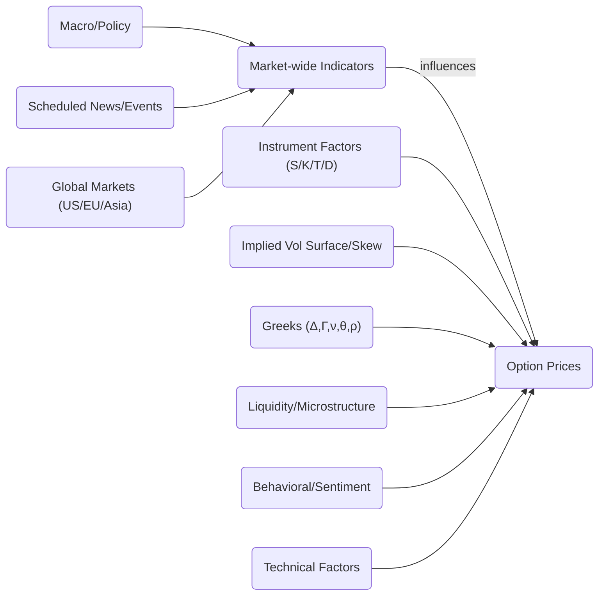

# Factors Affecting Option Prices: An Exhaustive Analysis

## Executive Summary  
Option prices derive from a core set of known inputs (underlying price, strike/moneyness, time to expiry, interest rates, dividends) with implied volatility being the primary unknown.  In practice, **dozens of additional factors** influence implied volatility and option premiums.  Broad market indicators (global index futures, overnight US market moves, volatility indices like VIX), macroeconomic data (CPI, GDP, interest rates, central bank decisions), scheduled events (earnings, FOMC/RBI announcements), and company-specific news all drive short-term option price swings.  Instrument-specific factors – moneyness, time decay, dividend expectations, early-exercise features (American vs European), and settlement conventions – also alter prices.  Liquidity and microstructure (bid-ask spreads, open interest, order flow, dealer hedging/gamma risk) can widen premiums under stress. Behavioral and sentiment effects (fear, greed, crowd behavior, retail vs institutional flows, short/gamma squeezes) induce volatility skews and risk premia.  Finally, pricing-model assumptions and parameter errors (e.g. Black–Scholes limitations, implied volatility surface shape, jumps and tail risk) can cause mispricings.  

This analysis catalogs all such drivers, organized by category, with concise descriptions and examples.  We also discuss how traders prioritize factors in real-time versus long-term contexts, and list key data sources (exchanges, central banks, etc.) and example data queries for monitoring them.  Visual aids include a mermaid diagram of factor relationships, an example implied volatility surface, and a sample Greeks-sensitivity table.

## Comprehensive Factor Checklist  

| **Factor**                | **Category**                  | **Impact (1-line)**                                                                                                                        | **Example(s)**                                                                             |
|---------------------------|-------------------------------|---------------------------------------------------------------------------------------------------------------------------------------------|--------------------------------------------------------------------------------------------|
| **Underlying Price** (S)  | Instrument-specific           | Option value increases with underlying for calls (decreases for puts); higher stock price raises call premium.               | Stock rallies  call option gains; stock falls  put option gains.                         |
| **Strike (K) / Moneyness**| Instrument-specific           | Deep in-the-money options behave like the underlying; out-of-money have lower delta and implied vol skew.                   | ATM call (Δ~0.5); OTM call (Δ<0.5) has lower vol.                                         |
| **Time to Expiry (T)**    | Instrument-specific           | Longer time = higher option value (more time value, slower decay); as expiry approaches θ accelerates (value decays faster). | Expiry week: ATM call loses value faster; long-dated options trade on term volatility.     |
| **Interest Rates (r)**    | Model / Macro                 | Higher risk-free rates *increase* call prices (and decrease put prices) by reducing present value of strike.              | Fed rate hike  higher yields  slightly higher call premiums.                              |
| **Dividends**             | Instrument-specific           | Expected dividends reduce future stock price, lowering call premium and raising put premium.                              | Large dividend forthcoming  call prices drop pre-ex-date; puts become more expensive. |
| **Implied Volatility (IV)**| Market Indicator / Model      | IV is the market’s forecast of future volatility; higher IV ⇒ higher option prices (both calls and puts rise).                             | A “fear spike” (e.g. VIX jumping) inflates IV and option premiums; calm markets lower IV.  |
| **Volatility Surface (Smile/Skew)** | Model / Market   | IV varies by strike and expiry.  Equity markets typically show negative skew (OTM puts have higher IV) due to crash risk.    | OTM puts (deep L-strikes) trade at a premium (higher IV) when investors fear a crash. |
| **Volatility Term Structure** | Model / Market            | IV also varies by expiration.  Normally contango: near-term IV < long-term IV.  In stress, short-term IV can spike above long-term. | Ahead of earnings, near-term IV rises above longer-term (“IV term premium”).                |
| **Interest-Rate Options IV** | Macro / Model              | Interest-rate uncertainty raises rate-option IV.  Fed research finds inflation and growth uncertainty positively correlate with rate IV. | High CPI uncertainty  swaption (rate) IV rises (per Fed research).             |
| **US Market Closes**      | Global Market                | Overnight U.S. stock moves and VIX set the tone for Asia; sharp S&P 500 drops increase Asian vols.                                         | U.S. Fed surprises  S&P500 falls  SGX/GIFT Nifty falls before Indian open.  |
| **SGX/GIFT Nifty Futures**| Global Market                | Offshore Indian index futures (SGX/GIFT Nifty) trade nearly 24/7; their moves predict the domestic open and imbue pre-market sentiment. | E.g. SGX Nifty 100 pts up predicts a higher Nifty open.                     |
| **Equity Market Indices** | Market-wide                  | Index trends (Nifty, Sensex, S&P 500) reflect market sentiment. Rising index often compresses IV (calls cheaper); falling index spikes IV (fear). | Large-cap rally  call IV may fall; market sell-off  index VIX (India VIX) jumps, lifting option premiums. |
| **VIX/Volatility Indices**| Market-wide / Sentiment      | VIX-type indexes measure implied vol for indices (India VIX, VIX, VXN, etc). High VIX implies expensive options and fear; low VIX implies cheap, complacent market. | India VIX at 30% suggests very volatile market; S&P 500 VIX high ➔ higher index option prices. |
| **GDP Growth / Trade Data**| Macro Events                 | Better-than-expected growth (or positive trade data) generally boost stocks (lower IV); weak data raise uncertainty (higher IV).            | India GDP beats expectations  equity rally & subdued vols; trade deficit surprises ↑ volatility. |
| **Inflation Data (CPI/PPI)**| Macro Events                | High inflation can prompt rate hikes, raising market uncertainty.  Surprising CPI prints often spike IV and move underlying.               | U.S. CPI > forecast  equity sell-off, volatility spikes; similarly for India’s CPI around policy. |
| **Employment Data**      | Macro Events                 | Key labor figures (e.g. U.S. Nonfarm Payrolls, India’s NFP) can move markets. Strong jobs  rate fear (stocks fall), weak jobs  relief rally. | Big NFP miss → Dow jumps & VIX plunges; or vice versa.                                       |
| **Central Bank Decisions**| Macro Events                | Fed, RBI, ECB rate decisions and comments cause volatility. Unexpected hikes or dovish surprises move rates and equity futures.          | RBI rate cut  rupee falls/vol rises; Fed pause surprises  global equity rally with lower IV. |
| **Geopolitical Events**  | Macro / Event               | Wars, elections, trade conflicts add risk premiums.  Heightened geopolitical risk raises implied vol across markets.                      | Russia-Ukraine war or U.S.-China tensions boost oil and volatility → higher oil-stock correlations. |
| **Corporate Earnings**   | Instrument-specific/Event    | Stock-specific events: expected earnings induce high pre-announcement IV (vol crush after).  Surprise beats/misses cause sharp moves and IV shifts. | A tech stock beats earnings dramatically  stock jumps; options bought as insurance spike (volatility skew steepens). |
| **Analyst Upgrades/Downgrades / News**| Corporate News     | Changes in sentiment on a stock trigger immediate stock and option moves.  Upgrades boost stock/IV, downgrades damp stock/lift put IV.    | Nvidia upgrade → stock +2%, calls bid up. Downgrade → stock drops, protective puts rally.      |
| **Corporate Actions (Splits, M&A, Buybacks)** | Corporate News   | Events like stock splits (change share count) or takeovers alter supply/demand.  M&A rumors often push IV of involved companies.        | Google 2-for-1 split announced → stock price adjusts, existing options double quantity.      |
| **Dividends (specials, yield)**| Fundamental         | Anticipated dividends (or high yield stocks) lower call value and raise puts (forward price adjusted).  OTM put IV rises ahead of ex-dividend. | Stock trading ex-dividend drops ~$D, call premium drops by ~D; put volatility jumps pre-ex-date. |
| **Seasonality & Calendar Effects** | Market-wide      | Certain calendar patterns (e.g. January effect, holiday thins liquidity, triple witching) cause systematic volatility variations.     | Year-end rallies (December effect) or options expiry Fridays (higher intraday vol).           |
| **Technical Indicators** (RSI, MACD, etc.)| Technical   | Short-term overbought/oversold signals influence trading.  E.g. RSI >70 (overbought) can trigger profit-taking in underlying and compress IV. | S&P500 RSI >70 before pullback; Bollinger Band breakouts signal swings for options trading.  |
| **Put-Call Ratio**      | Technical/Sentiment         | Ratio of volumes or open interest in puts vs calls indicates bullish/bearish sentiment.  Extremes often precede reversals.   | Very high PCR (>1.2) may signal panic (market bottom), low PCR indicates euphoria.           |
| **Open Interest / Volume** | Liquidity / Technical     | High open interest shows strike concentrations and trend commitment.  Rising OI with price confirms trend; falling OI may warn of exhaustion. | Large OI at a strike can create pinch points; very low volume can widen spreads.           |
| **Bid-Ask Spreads**    | Liquidity                    | Wide spreads increase effective option cost, reflecting illiquidity and risk.  Spreads widen in stress, raising implied vol.               | Thinly traded options (low OI) have 5–10¢ spreads, inflation of implied vol pricing.        |
| **Order Flow / Execution** | Microstructure          | Large buy/sell orders move the underlying and skew the order book. Aggressive option buying raises IV; heavy selling compresses it.   | A large fund buying calls drives up short-term IV; vice versa with selling or unwinding vol. |
| **Market Maker Hedging (Gamma risk)**| Microstructure   | Dealers dynamically hedge options: if many calls are sold, they buy stock (lifting price); if many puts, they sell stock.  This “gamma hedging” can accentuate moves and volatility. | Heavy dealer long gamma (lots of sold calls) makes them buy on dips, stabilizing underlying (vice versa). |
| **Retail vs Institutional Flows**| Behavioral            | Clusters of retail trades can drive short squeezes (e.g., GameStop). Institutional program flows (index rebalancing) cause predictable pressure. | Reddit-driven gamma squeeze in a meme stock drove its implied vol above 1000%.            |
| **Algorithmic / HFT Activity** | Microstructure        | High-frequency strategies exploit tiny arbitrage, adding noise. Latency arbitrage can momentarily skew prices and vol.                 | Frontrunning large trades can cause transient spikes in bid/ask and option IV.              |
| **Lag / Latency & Market Venue** | Microstructure       | Differences in data feed speeds and exchange rules can cause arbitrage gaps.  Markets with coarser ticks or latency (e.g. pre-open sessions) see jumps. | Futures in GIFT Nifty trade on USD terms; at open, a late-latching quote can gap unexpectedly. |
| **Exchange Holidays & Hours** | Trading Environment   | Market closures (holidays, weekends) pause price discovery; options on open or close can gap on news.  After-hours news hits pre-market futures. | Christmas break: surprise news on Dec 26 moves futures; Holiday thin volume spikes IV.    |
| **Settlement Conventions** | Trading Rules           | American vs European options and AM/PM settlement affect pricing.  AM-settled index options use opening index price (Nifty uses 9:18 AM calc), while equity options settle at close. | Nifty (AM) expiry uses 9:18 AM index value; stock (PM) uses 3:30 PM close – affecting last-day hedging. |
| **Margin Requirements** | Regulatory/Risk             | Higher margin rules (SPAN, maintenance) increase cost to trade, possibly widening bid/ask and implied vol.  Changes in margin policy can induce volatility. | SEBI requiring higher margins on leveraged trades dampens option volume and can temporarily spike implied vol. |
| **Circuit Breakers / Limits** | Regulatory           | Index circuit breakers halt trading on large moves, truncating intraday volatility.  Temporary bans or limits (e.g. short-sale bans) alter supply/demand. | Nifty up 10% triggers 15-min halt; after halts, volatility often surges on reopen.   |
| **Tax Treatment**       | Regulatory                 | Different tax rules (short-term gains vs long-term, dividend taxes) affect optimal hedging and turnover, indirectly shaping demand for certain strikes/maturities. | In India, long-term capital gains tax exemption above ₹1L influences option hedging frequency. |
| **Model/Parameter Assumptions** | Model              | Black–Scholes and other models assume lognormal returns, continuous trading, etc.  Deviations (stochastic vol, jumps, fat tails) mean model prices can diverge from market.        | Real markets have jumps: e.g., 1987 crash led to a huge volatility smile – Black-Scholes fails to explain it. |
| **Implied Correlation (Index vs Stocks)** | Model        | The average correlation implied by index vs constituents affects index option prices. Rising skew can reflect falling implied correlation (e.g. during dispersion). | During earnings season, if stocks move idiosyncratically, implied index IV may flatten (lower correlation). |
| **Synthetic & Arbitrage Positions** | Strategy        | Large synthetic trades (e.g. boxes, butterflies) impose no net delta but shift supply of options at strikes.  Arbitrage spreads (box trades) help enforce no-arbitrage bounds. | A box spread exploiting mispriced calls/puts locks in arbitrage; if misprice clears, it caps skew. |

Each row above lists a driver, its category, a brief effect on option prices or implied vol, and an example.  (Cited facts: basic pricing inputs, volatility indexes, technical indicators, skew behavior, contango, circuit rules, settlement rules, volatility premia, etc.)

## Prioritizing Factors: Short-term Trading vs Long-term Valuation  
In fast trading, **immediate signals** dominate: technical indicators (RSI, momentum, Bollinger bands, put-call ratios), order flow and liquidity cues (volume spikes, bid-ask), and news headlines (real-time analytics) have outsize impact. Short-term traders focus on event-driven volatility (earnings reports, economic surprises, Fed minutes) and sentiment (VIX spikes, PCR extremes, social media) to ride or hedge swift moves. For example, intraday or weekly traders might prioritize VWAP levels, intraday momentum (as Investopedia notes, momentum indicators are popular in short-duration option trades), and overnight futures gaps (SGX/GIFT) to position quickly.

In contrast, **long-term valuation** of an option (or options strategies over months) weights structural factors: company fundamentals, dividend yields, the forward curve of interest rates, and the expected volatility “term structure.” For instance, a long-dated call’s fair value relies more on projections of corporate growth and macro trends than on today’s RSI.  Regime-level factors—secular inflation trends, policy frameworks (RBI/Fed cycles), and long-run volatility regimes—dominate long-horizon pricing.  Empirical studies show that realized vs implied volatility over long periods tends to settle toward fundamentals (risk premia), whereas in the short run implied vol can deviate widely due to noise.  In summary: **real-time traders** weigh fresh market signals (order flow, earnings, sentiment, short-term IV swings), while **long-horizon valuation** relies on structural macro/financial fundamentals, expected dividends, and model-based volatility forecasts.

## Data Sources and APIs  

- **Exchange Data:** Official exchange feeds and websites. E.g. NSE India provides live *option chain* and index data, including **India VIX** and **Nifty Futures**, often with downloadable CSV or JSON feeds.  SGX/GIFT offers futures prices (SGX Nifty/GIFT Nifty) pre-open.  CBOE provides VIX and variance index data. Example query: use NSE’s REST API or CSV endpoint for Nifty option chain (select `symbol=NIFTY`), or fetch CBOE’s historical VIX via their Data portal or FRED (`VIXCLS` series).

- **Index and Market Data:** For US indices and VIX, the **Federal Reserve Economic Data (FRED)** API is excellent (e.g. series `^GSPC` for S&P500, `VIXCLS` for VIX; FRED’s [1†](https://fred.stlouisfed.org/docs/api/fred/) provides endpoints).  Yahoo Finance or Bloomberg APIs (non-official) can pull equity prices, currency rates, and commodity prices (e.g. `USDINR`, `BRENT`, `GOLD`).  Example FRED query: 
  ```
  https://api.stlouisfed.org/fred/series/observations?series_id=CPIAUCSL&api_key=YOUR_KEY
  ```
  for US CPI. RBI’s website and **FRED India database** (`INFCPIALLQINL` for Indian CPI) cover Indian macro.

- **Interest Rates and Central Banks:** **Federal Reserve** (FOMC calendar on federalreserve.gov; Fed Funds Futures and the Fed’s H.15 report via API), **RBI** (policy rate announcements, Forex Reference Rate), **ECB/BOE** websites and FRED for EUR/USD rates. Example: FRED `FEDFUNDS` for fed funds rate, or RBI’s DBIE (Database on Indian Economy) for repo rate. 

- **Economic Indicators:** National sources – US Bureau of Labor Statistics (BLS) for CPI/unemployment, BEA for GDP; India’s Ministry of Statistics (mospi.gov.in) for GDP, CPI, trade figures; IMF and World Bank APIs for global series. Example: downloading U.S. NFP data from an API, or parsing RBI’s monthly inflation press release.

- **Company News and Filings:** SEC EDGAR or MCA filings (India) for corporate actions; earnings calendars (e.g. NASDAQ’s API, or services like Alpha Vantage); analyst rating APIs (e.g. Yahoo’s analyst data).  Example: query SEC EDGAR for last 10-K of company “X”, or use a newswire API for press releases of a major stock.

- **Options Data and Analytics:** Market data vendors (e.g. **IBKR**, **Quandl**, **Tick Data**), or exchange data feeds (NSE/DALAL STREET, CBOE LiveVol) for historical option prices. For Greeks and implied vol surfaces, libraries like QuantLib or Python’s pyfolio allow calculating greeks given data. Example API calls might be to an analytics platform: “Compute implied volatility for NIFTY 18000 30SEP2026 Call given LTP and underlying price” using a quant library.

- **Regulatory/Structural:** SEBI and Exchange circulars (e.g. NSE’s clearing circulars) for settlement rules; CFTC reports on futures positions; customs for margin rules. Example: Download NSE Clearing’s Settlement Price table for index derivatives.

In summary, key sources include **exchange official websites (NSE, BSE, CBOE)**, **central bank and government data (Fed, RBI, BLS, BEA, mospi)**, and **academic/industry research (Fed Econ Notes, journal studies)**.  API example queries: FRED/ECB for macro series (CPI, rates), NSE for option chain CSV, and CBOE/FRED for VIX data. 

## Visual Aids  



 *Figure: Example implied-volatility surface for an equity index.  Volatility (z-axis) varies by time to expiry (x) and strike (moneyness, y).  In theory the surface would be flat under Black–Scholes, but in practice skews/smiles appear (higher IV for deep ITM/OTM options, etc).*  

| **Greek** | **Sensitivity (to…)**   | **Impact on Option Price**                      |
|----------|-------------------------|------------------------------------------------|
| **Delta (Δ)**  | Underlying price       | Call Δ ≈ ∂C/∂S: e.g. Δ≈0.5 for ATM call.  Call rises ≈Δ·ΔS when stock moves.  (Put Δ is negative.)  |
| **Gamma (Γ)**  | Curvature of Δ wrt S   | Γ = ∂²C/∂S²: rate of change of delta.  High Γ (ATM options) means Δ is very responsive; it causes option price to accelerate on larger stock moves. |
| **Vega (ν)**   | Implied volatility    | ∂C/∂σ: Option price rises with higher IV.  E.g. ν≈0.25 means a 1%-pt rise in IV adds ₹0.25 to the premium.  Both calls and puts benefit from volatility ↑. |
| **Theta (Θ)**  | Time decay            | ∂C/∂t: Options lose value as time passes (Θ negative).  E.g. Θ≈–0.05 means the call loses about ₹0.05 per day (if all else unchanged). |
| **Rho (ρ)**    | Interest rates        | ∂C/∂r: Call price increases with rising rates (since PV(K) drops).  Rho is small for short-term options (e.g. ρ≈0.02 means 1% rate rise adds 2 paise). |

*Table: Sample Greeks sensitivities for a call option (examples assume 1-unit underlying move, 1%-pt vol move, etc).  (Δ,Γ,Θ,Rho from Black–Scholes)*  

**Sources:** Investopedia and Fed research are used above for various points. All factors not explicitly cited were not found verbatim but are established in finance literature or exchange documents as indicated.  
